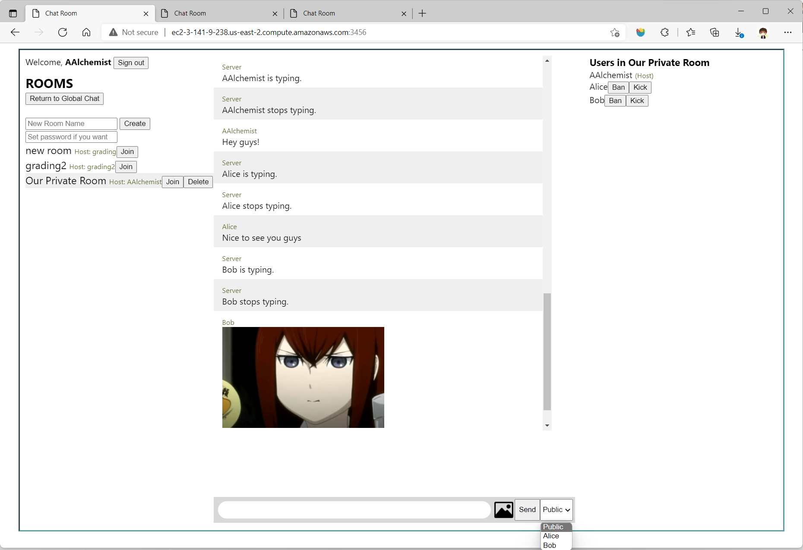

## Multi Room Chat Server
Link to server: http://ec2-3-141-9-238.us-east-2.compute.amazonaws.com:3456/

- You can sign in with any username which is not duplicate to the existing ones. 
- Users can create chat rooms with an arbitrary non duplicate room name
- Users can join an arbitrary chat room
- The chat room displays all users currently in the room
- A private room can be created that is password protected
- Creators of chat rooms can temporarily kick others out of the room
- Creators of chat rooms can permanently ban users from joining that particular room  
Messaging:
- A user's message shows their username and is sent to everyone in the room
- Users can send private messages to another user in the same room